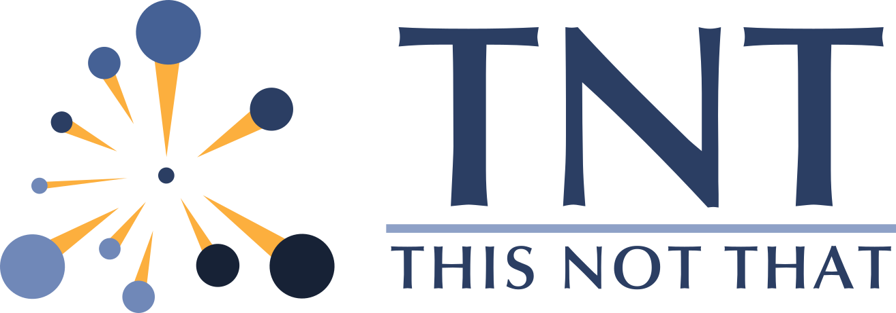

.. thisnotthat documentation master file, created by
   sphinx-quickstart on Wed Aug 17 12:41:49 2022.
   You can adapt this file completely to your liking, but it should at least
   contain the root `toctree` directive.

This Not That: A Data Map Exploration Tool
==========================================

This Not That (TNT) is a suite of tools, built atop the `Panel library`_, for
quickly and easily exploring data maps, as well as constructing more complex
web applications around data maps.

TNT is still in initial development stages, so bear with us as we continue
to build out features and make it easier to use.

.. toctree::
   :maxdepth: 2
   :caption: Quick Start:

   installing
   using_notebooks
   deploying_apps

.. toctree::
   :maxdepth: 2
   :caption: User Guide:

   basic_concepts

.. toctree::
   :maxdepth: 2
   :caption: Tutorials:

   metadata_cluster_labels
   joint_vector_cluster_labels
   sampling_cluster_labels

.. toctree::
   :maxdepth: 2
   :caption: API:

   api

Indices and tables
==================

* :ref:`genindex`
* :ref:`modindex`
* :ref:`search`

.. _Panel library: https://panel.holoviz.org/